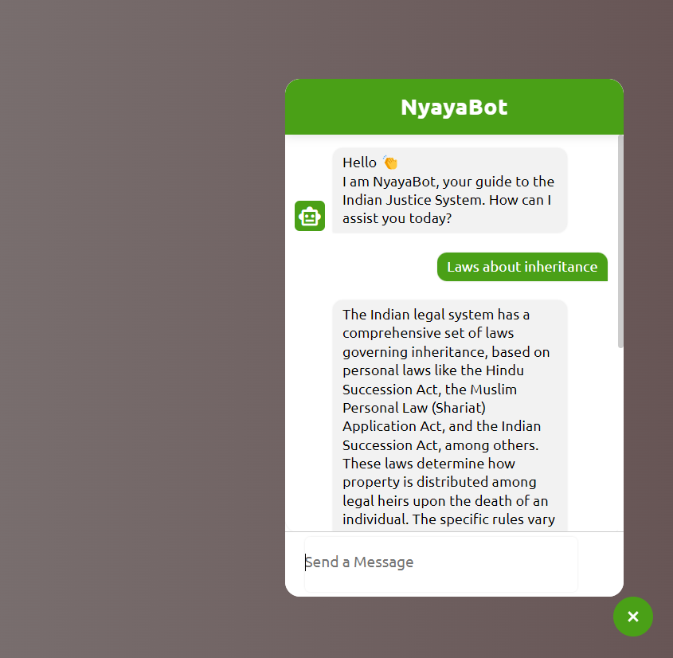

# NyayaBot
## A ChatBot to answer questions related to the Indian Judiciary System.
- The bot has been trained directly from the Indian Constitution.
- Also, the bot has been trained over data from the website of DoJ, India.
- Integrated LLM to make sure the answers given are human-like.

  - [Live Preview](https://prakshark.github.io/NyayaBot/)

  
